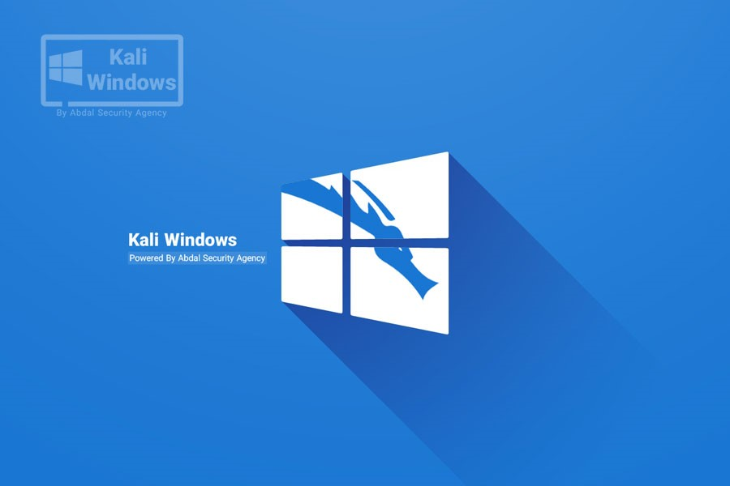
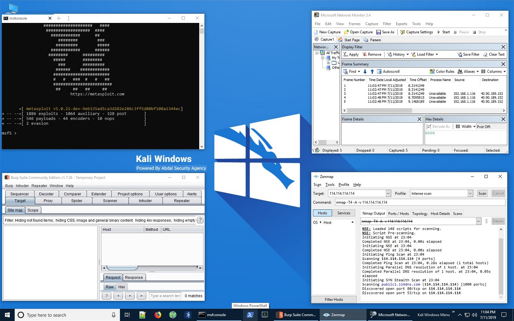

# Kali Windows

作为安全从业人员，Kali都是必备工具箱，一款作为黑客常用工具的集合平台深受安全人员喜欢。但是Kali是从BT5转变而来，所以是基于Linux系统集成的。作为很多工控安全从业者因为都是使用Windows平台来做日常支撑平台。那今天介绍一款基于Windows 10打造的Kali渗透工具平台（Kali Windows V1.1），此款平台与Kali Linux并无关系。此款工具平台是一款免费的工具平台。

这个镜像是已经含有Windows 10的系统。
注意：如果是采用vmware虚拟机安装，推荐CPU为2 vCPU，内存为8G，硬盘建议100G，全部安装完毕后将会占用66G。另外有一点比较重要vmware创建虚拟机时候一定要选择BIOS引导不要选择UEFI，否则可能会找不到DVD设备。

进入系统后就可以看到大家喜欢的工具，界面如下：

 
Kali Windows工具平台提供以下工具集：

DDOS Attacks

    abdal-loris
    slowloris
    slowloris6.pl
    hping
    slowloris.pl 

Fun

    FakeHack
    HackerTyper
    RandHackNum

Information Gathering

    Advanced IP Scanner
    Angry IP Scanner
    HTTP Debugger Pro
    IP List Generator 2 (x64)
    IP Subnet Calculator
    netscan
    Nmap – Zenmap GUI
    SearchDiggity
    snmptest

Multimedia

    AIMP
    PotPlayer 64 bit

Password Attacks

    aircrack-ng-gui
    aircrack
    Burp Suite Community Edition
    crunch
    hashcat
    hydra
    john-the-ripper
    msfconsole
    Nmap – Zenmap GUI
    patator
    Sentry_MBA

Programming

    adb
    CodeBlocks
    Git Bash
    Git CMD
    Git GUI
    GitHub Desktop
    JetBrains GoLand 2019.1 x64
    JetBrains GoLand 2019.1
    JetBrains PhpStorm 2019.1 x64
    JetBrains PhpStorm 2019.1
    JetBrains PyCharm 2019.1.1 x64
    Notepad++
    xampp-control

Reverse Engineering

    adb
    APK Easy Tool.exe
    apk-editor-studio
    apktool
    autoruns.exe
    bindiff.jar
    CFF Explorer
    Colasoft Packet Builder 2.0
    de4dot-x64.exe
    de4dot.exe
    dnSpy
    Elcomsoft eXplorer for WhatsApp
    Elcomsoft Phone Breaker
    idaPlus.exe
    ILSpy.exe
    Immunity Debugger
    jd-gui
    Moo0 File Monitor 1.11
    Odin3
    ollydbg
    PE Detective
    PE Explorer
    Proccess Explorer.exe
    Process Hacker 2
    ProcessActivityView
    ProcessActivityView64
    Procmon.exe
    RamDebugger
    RAMMap
    RebelDotNET
    Registrar Registry Manager (32-bit)
    Registrar Registry Manager (64-bit)
    RegScanner
    SNSRemover
    SuperOneClick
    Task Explorer (32-bit)
    Task Explorer (64-bit)
    WinDbg (X64)
    WinDbg (X86)

Command Line

    Windows PowerShell
    Command Prompt
    Console

Exploitation Tools

    ExploitPack
    msfconsole
    nc
    nc64
    Nmap – Zenmap GUI
    UST
    windows-exploit-suggester
    XAttacker

Hardware Hacking

    adb
    APK Easy Tool.exe
    apk-editor-studio
    apktool
    Elcomsoft Phone Breaker
    jd-gui
    Odin3

Mobile Tools

    adb
    androbugs
    APK Easy Tool.exe
    apk-editor-studio
    apktool
    de4dot-x64.exe
    de4dot.exe

Network & Internet

    Cisco AnyConnect Secure Mobility Client
    Colasoft Packet Builder 2.0
    curl
    FileZilla Server Interface
    Firefox
    HTTP Debugger Pro
    Internet Download Manager
    IP List Generator 2 (x64)
    IP Subnet Calculator
    Mantra
    MegaPing
    Nmap – Zenmap GUI
    OpenConnect-GUI VPN client
    Proxifier
    SearchDiggity
    Skype
    SmartWhois
    Start Tor Browser
    wget
    YouTube View Increaser

Rat & SpyWare

    Agent Tesla
    AhMyth
    Black Stealer
    DarkComet
    DarkCometRAT Remover
    Droidjack
    Nano File Binder
    SpyNote
    UST

Security

    KeePass 2
    Malwarebytes Windows Firewall Control
    RunPEDetector
    sdelete
    VeraCrypt
    WinAuth.exe
    XArp

Utility

    AnyDesk
    BlueScreenView
    DAEMON Tools Ultra
    FileZilla Server Interface
    Git Bash
    Hard Disk Sentinel
    hostseditor
    Internet Download Manager
    MantraPortable
    Rainmeter
    Resource Monitor
    rufus
    services
    Speccy
    Task Scheduler
    UltraISO
    Universal-USB-Installer
    win32diskimager
    Your Unin-staller!

Web Applications

    Burp Suite Community Edition
    grabber
    HTTrack Website Copier
    hurl
    Maltego
    N-Stalker Free X
    Netsparker
    OWASP ZAP 2.7.0
    SearchDiggity
    Web Data Extractor
    WebSiteSniffer
    XAttacker

Forensic

    adb
    Advanced Archive Password Recovery
    Advanced Office Password Recovery
    androbugs
    APK Easy Tool.exe
    apk-editor-studio
    apktool
    autoruns.exe
    bintext.exe
    BlueScreenView
    Byte_Adder
    Cain
    CFF Explorer
    Colasoft Packet Builder 2.0
    de4dot-x64.exe
    de4dot.exe
    DriverList_IA64
    DriverList_x64
    DriverList_x86
    Elcomsoft eXplorer for WhatsApp
    Elcomsoft Phone Breaker
    Elcomsoft Wireless Security Auditor
    Ettercap-0.7.4.
    File Size Changer
    Hard Disk Sentinel
    HTTP Debugger Pro
    idaPlus.exe
    ILSpy.exe
    Immunity Debugger
    Listdlls
    Microsoft Network Monitor 3.4
    Moo0 File Monitor 1.11
    NetworkMiner
    Nmap – Zenmap GUI
    PE Detective
    PE Explorer
    PrcView
    Proccess Explorer.exe
    Process Hacker 2
    ProcessActivityView
    ProcessActivityView64
    RAMMap
    RegScanner
    rekal
    SearchDiggity
    ssdeep
    Task Explorer (32-bit)
    Task Explorer (64-bit)
    Wireshark

Remote Control

    AnyDesk
    nc
    nc64
    pageant
    plink
    pscp
    psftp
    putty
    puttygen
    puttytel
    winbox
    Xftp
    Xlpd
    Xmanager
    Xshell

Sniffing & Spoofing

    Byte_Adder
    Cain
    Change MAC Address
    Colasoft Packet Builder 2.0
    Ettercap-0.7.4.
    File Size Changer
    HTTP Debugger Pro
    Microsoft Network Monitor 3.4
    Nano File Binder
    NetworkMiner
    RawCap
    SMAC 2.0
    UST
    WebSiteSniffer
    Wireshark
    YouTube View Increaser

Virus Coding

    AutoIt Window Info (x64)
    AutoIt Window Info (x86)
    Byte_Adder
    CodeBlocks
    File Size Changer
    SciTE Script Editor

Wireless Attacks

    airbase-ng
    Aircrack-ng-GUI
    aircrack-ng
    airdecap-ng
    airdecloak-ng
    aireplay-ng
    airodump-ng
    airolib-ng
    airserv-ng
    airtun-ng
    airventriloquist-ng
    besside-ng
    buddy-ng
    Chanalyzer Pro
    CommView for WiFi
    Connectify Dispatch
    Connectify Hotspot
    easside-ng
    gwepdecrypt
    inSSIDer 4
    ivstools
    Jumpstart
    kstats
    makeivs-ng
    Network Stumbler
    packetforge-ng
    RawCap
    tkiptun-ng
    Vistumbler
    wesside-ng
    WirelessMon
    WirelessNetView.exe
    wpaclean

开机用户名和密码，请联系剑思庭
